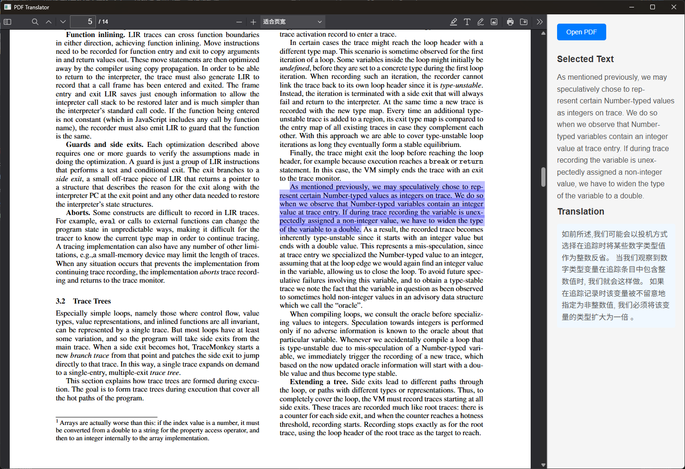

# Pdf Translator

一个简单的PDF阅读器。可以实现完全本地化的英-中翻译功能（依靠`opus-mt-en-zh`模型）。



PdfTranslator使用Drogon来构建应用程序本地服务后端，使用webview构建应用程序APP界面（前端页面），使用OnnxRuntime C++ API作为神经网络推理框架。

# 平台支持

平台 | 支持情况
-------- | ------------
Linux    | 施工中~
macOS    | 施工中~
Windows  | 支持CPU推理

# 配置文件介绍

默认配置文件`deploy/llm_config.json`如下：

```json
{
    "number_thread": 8,
    "optimization_level": "EXTENDED",
    "max_length": 512
}
```

各字段的含义如下：

字段 | 含义
-------- | ------------
number_thread | 推理使用的线程池线程数量，数量在1~16之间，默认为4
optimization_level | OnnxRuntime推理库优化模型结构的优化等级，在`DISABLE`，`BASIC`，`EXTENDED`，`ALL`之间选择，默认为`DISABLE`
max_length | 输出文本的最大token数量，数量在128~4096之间，默认为128

# Packages

库 | 简介
-------- | ------------
[webview](https://github.com/webview/webview) | 用于作为前端页面展示
[sentencepiece](https://github.com/google/sentencepiece) | 用作模型推理后端
[drogon](https://github.com/drogonframework/drogon) | 用作本地服务器后端实现理
[json](https://github.com/nlohmann/json) | 读取应用程序json配置文件
[bimap](https://github.com/yekhlakov/bimap) | 用于Tokenize和Detokenize时双向文本映射
[pdf.js](https://github.com/mozilla/pdf.js) | 用于Web端的PDF解析

# 模型文件

**opus-mt-en-zh**

opus-mt-en-zh是一个开源的用于英-中翻译的，基于Marian-NMT架构的文本生成模型。你可以从以下任意一个网站中下载所需的模型文件：

* [huggingface](https://huggingface.co/Helsinki-NLP/opus-mt-en-zh)
* [hf-mirror](https://hf-mirror.com/Helsinki-NLP/opus-mt-en-zh)
* [modelscope](https://modelscope.cn/models/Helsinki-NLP/opus-mt-en-zh)

要将其用于OnnxRuntime推理，需要进行模型转换。模型转化之前，需要配置相应的python环境，以python 3.12为例：

```shell
conda create -n PdfTranslator python=3.12
conda activate PdfTranslator
pip install transformers sentencepiece sacremoses "optimum[exporters,onnxruntime]"
optimum-cli export onnx --model Helsinki-NLP/opus-mt-en-zh --task translation <your_output_path>
```
其中将`<your_output_path>`改为期望的模型输出路径。在模型输出的路径中，有四个文件：

* encoder_model.onnx
* decoder_model.onnx
* generation_config.json
* config.json

然后从上面的网站中下载下面两个文件：

* source.spm
* target.spm

用于分词器模型使用。


# 源码构建

## 1. Windows

### 1.1 克隆仓库

首先把本仓库克隆到本地：
```shell
git clone --recursive https://github.com/HSB0y/PdfTranslator PdfTranslator
```

### 1.2 webview构建

使用下面的构建命令进行构建，建议使用[Ninja](https://github.com/ninja-build/ninja)构建工具，其中`<WEBVIEW_INSTALL_PATH>`替换为实际安装位置：

```shell
git clone --recursive https://github.com/webview/webview webview
cd webview
cmake -B build -G Ninja -DCMAKE_BUILD_TYPE=Release -DCMAKE_INSTALL_PREFIX=<WEBVIEW_INSTALL_PATH>
cmake --build build --parallel
cmake --install build
cd ..
```

### 1.3 sentencepiece构建

可以直接从GitHub上下载编译好的二进制文件（[下载地址](https://github.com/google/sentencepiece/releases/tag/v0.2.1)）,或者直接从源码构建，其中`<SENTENCEPIECE_INSTALL_PATH>`替换为实际安装位置：

```shell
git clone --recursive https://github.com/google/sentencepiece sentencepiece
cd sentencepiece
cmake -B build -G Ninja -DCMAKE_BUILD_TYPE=Release -DCMAKE_INSTALL_PREFIX=<SENTENCEPIECE_INSTALL_PATH>
cmake --build build --parallel
cmake --install build
cd ..
```

### 1.4 下载OnnxRuntime二进制构建文件

从Github仓库上下载编译好的二进制文件（[下载链接](https://github.com/microsoft/onnxruntime/releases/tag/v1.17.1)），解压到实际位置（设实际位置为`<ONNXRUNTIME_INSTALL_PATH>`）。

### 1.5 下载项目第三方文件到项目结构中

从Github仓库上下载编译好的`Pdf.js`二进制文件（[下载链接](https://github.com/microsoft/onnxruntime/releases/tag/v1.17.1)），解压到本仓库的`deploy`路径下。

从[模型文件](#模型文件)章节中，下载模型文件到本仓库的`deploy/llm`路径下。

最后得到的目录结构应该如下所示：

```
| controllers
    | ...
| deploy
    | llm
        | encoder_model.onnx
        | decoder_model.onnx
        | source.spm
        | target.spm
        | vocab.txt
    | pdfjs
        | build
            | ...
        | web
            | ...
        LICENSE
    config.yaml
    index.html
    llm_config.json
| ...
```
### 1.6 开始构建

```shell
cmake -B build -G Ninja -DCMAKE_BUILD_TYPE=Release -Dwebview_DIR=<WEBVIEW_INSTALL_PATH>\lib\cmake\webview -DONNXRUNTIME_DIR=<ONNXRUNTIME_INSTALL_PATH> -DSENTENCEPIECE_DIR=<SENTENCEPIECE_INSTALL_PATH>
cmake --build build --parallel
```

构建完成后，可执行文件路径在仓库目录下的`deploy`目录下。

## 2. macOS

施工中~

## 3. Linux Distributions

施工中~

# 后续工作

1. 增加对`macOS`和`Linux`各发行版的支持
2. 增加`fp16`和`bf16`量化的支持
3. 在`Windows`端启用`DirectML`加速模型推理
4. 完善代码注释内容
